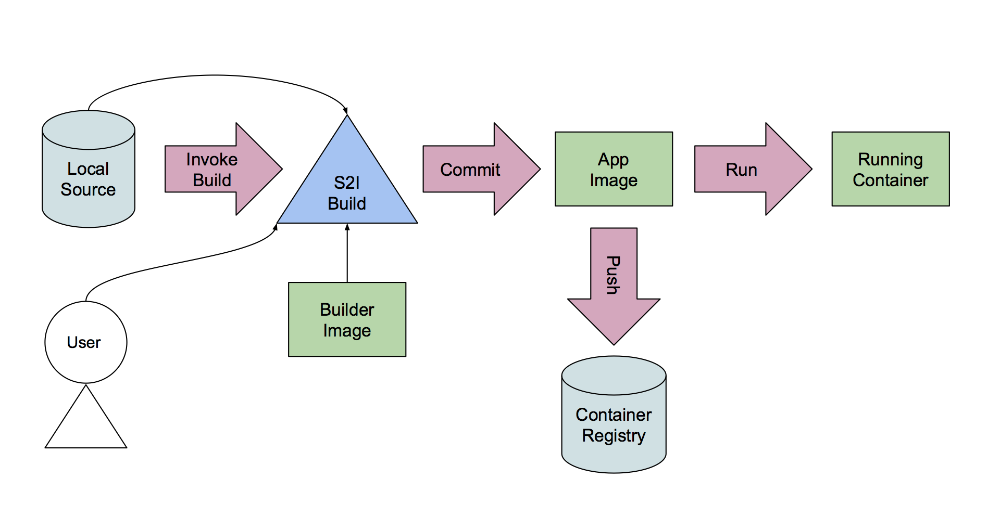

The "source code" is made up of files under a src/ directory.

This directory contains the 'source code' which can be 'built' using the S2I Builder Image which was created in the previous step. 



The simple-cat-runtime will output the contents of any files inside a "src/" directory.   That's all!! 

## Try this out

To try this out use this pre existing src/ directory which contains the 'source code' files, hellofile and worldfile.  Make sure you change directory into "myapp" or you have a sub-directory named "src" which holds some text files.

``cd runtime``{{execute}}
``find src``{{execute}}

The output of this command should be the same as or similar to:

```
src
src/hellofile
src/worldfile
```

As a developer, you might want to "test" your application.  To do this, simply run the "cat runtime" as follows:

``cat src/*``{{execute}}

```
Hello
World
```

To build your very simple application, use one of the following ways.

## 1st way

Build using a build configuration that uploads the files from the current working directory and then launch the resulting image 

``oc new-build --binary=true --name myapp-try1``{{execute}}

``oc start-build myapp-try1 --from-dir=runtime --follow --wait``{{execute}}

Create an application from the newly created myapp-try1 image.

``oc new-app myapp-try1``{{execute}}
``oc get pod``{{execute}}

Show the "simple application" is working by displaying its output. 

``oc logs <myapp-try1-pod>``{{execute}}


## 2nd way

Build using a binary build configuration and then launch the resulting image 

``oc new-build s2i-simple-builder --name myapp-try2 --binary=true``{{execute}}

Start the s2i build process which will run the s2i builder image, upload the current directory (--from-dir=.) into it and execute the assemble script. 

``oc start-build myapp-try2 --from-dir=.       ``{{execute}}
``oc logs bc/myapp-try2 -f``{{execute}}

Create an application from the newly created myapp image.

``oc new-app myapp-try2``{{execute}}
``oc get pod``{{execute}}

Show the "simple application" is working by displaying its output. 

oc logs <pod>

## 3rd way

Build and launch a new application with one command, using "oc new-app".

oc new-app s2i-simple-builder . --name myapp-try2
(Note that this command will upload the 'current directory' to the s2i builder container.)


